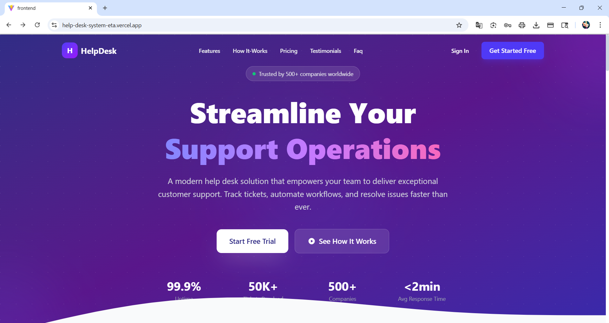
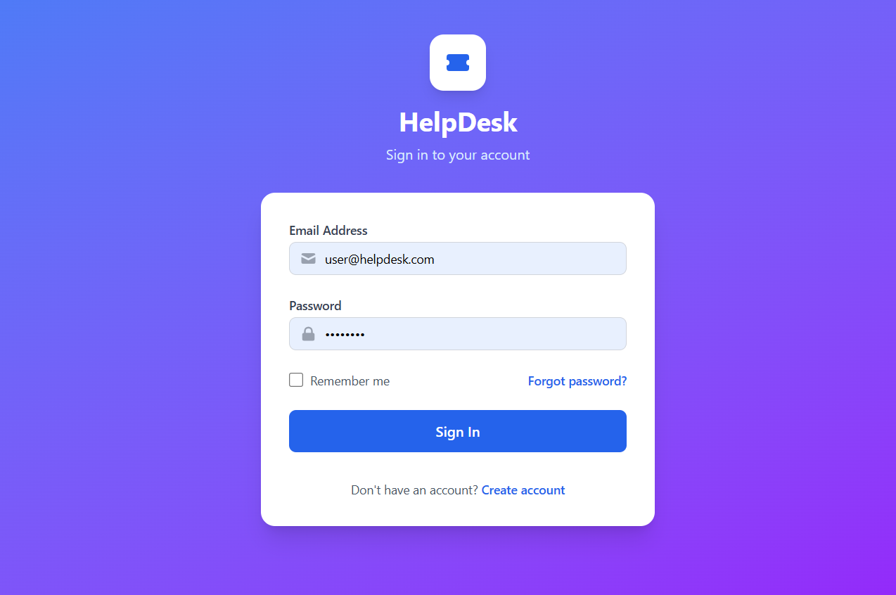
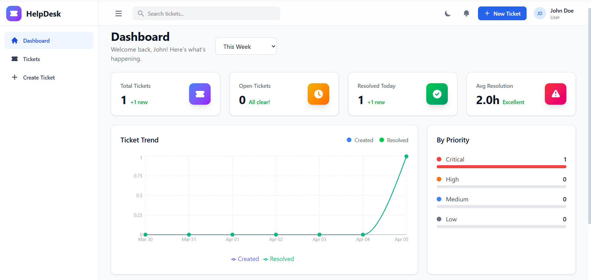

<div align="center">

# 🎫 HelpDesk - Modern Support Ticket Management System

<p align="center">
  <strong>A full-stack help desk solution built with .NET 8 and React for streamlined customer support operations.</strong>
</p>

<p align="center">
  
  
  
  
  
  
</p>

<p align="center">
  <a href="https://help-desk-system-eta.vercel.app">🌐 Live Demo</a> •
  <a href="https://helpdesksystem-id4m.onrender.com/swagger">📖 API Docs</a>
</p>

</div>

---

## 📋 Table of Contents

- [Overview](#-overview)
- [Features](#-features)
- [Tech Stack](#-tech-stack)
- [Architecture](#-architecture)
- [Screenshots](#-screenshots)
- [Getting Started](#-getting-started)
- [Project Structure](#-project-structure)
- [API Documentation](#-api-documentation)
- [Deployment](#-deployment)
- [Demo Credentials](#-demo-credentials)
- [Contributing](#-contributing)
- [License](#-license)

---

## 🌟 Overview

**HelpDesk** is a modern, full-stack support ticket management system designed to streamline customer support operations. Built with **Clean Architecture** principles, it provides a robust backend API and a responsive React frontend with real-time notifications.

Whether you're managing IT support tickets, customer inquiries, or internal requests — HelpDesk provides the tools your team needs to deliver exceptional support.

---

## ✨ Features

### 🎫 Ticket Management
- Create, update, assign, and resolve support tickets
- Ticket categorization with categories and departments
- Priority levels (Low, Medium, High, Critical)
- Status tracking (Open, In Progress, Resolved, Closed)
- Full ticket history and audit trail
- File attachments support (images, documents, archives)

### 📊 Dashboard & Analytics
- Real-time dashboard with key metrics
- Tickets by department chart
- Tickets by priority distribution
- Ticket trend analysis over time
- Recent tickets overview
- Stats cards with dynamic data

### 🔔 Real-Time Notifications
- Instant push notifications via **SignalR**
- Browser notification support
- Unread notification counter
- Notification center with mark as read
- Auto-reconnect on connection loss

### 👥 User Management
- Role-based access control (**Admin**, **Agent**, **User**)
- User registration and authentication
- Profile management with avatar
- Password change functionality
- Account settings

### 🔐 Authentication & Security
- JWT (JSON Web Token) authentication
- Role-based route protection
- Secure password hashing with ASP.NET Core Identity
- Token-based API authorization
- Password reset via email

### 📧 Email Integration
- Automated email notifications on ticket updates
- Password reset emails
- SMTP configuration (Gmail supported)
- Customizable email templates

### 🛠️ Admin Panel
- User management (create, edit, activate/deactivate)
- Department management
- Category management
- System settings
- Reports and analytics

---

## 🛠️ Tech Stack

### Backend
| Technology | Purpose |
|-----------|---------|
| **.NET 8** | Web API framework |
| **ASP.NET Core Identity** | Authentication & authorization |
| **Entity Framework Core 8** | ORM & database management |
| **PostgreSQL** | Primary database |
| **SignalR** | Real-time WebSocket communication |
| **AutoMapper** | Object-to-object mapping |
| **FluentValidation** | Request validation |
| **Serilog** | Structured logging |
| **JWT Bearer** | Token-based authentication |
| **Swagger/OpenAPI** | API documentation |

### Frontend
| Technology | Purpose |
|-----------|---------|
| **React 19** | UI library |
| **TypeScript 5.9** | Type-safe JavaScript |
| **Vite 7** | Build tool & dev server |
| **Tailwind CSS 4** | Utility-first CSS framework |
| **React Router 7** | Client-side routing |
| **TanStack React Query 5** | Server state management |
| **Zustand** | Client state management |
| **React Hook Form + Zod** | Form handling & validation |
| **Recharts** | Data visualization charts |
| **SignalR Client** | Real-time notifications |
| **Axios** | HTTP client |
| **React Hot Toast** | Toast notifications |

### DevOps & Deployment
| Technology | Purpose |
|-----------|---------|
| **Vercel** | Frontend hosting |
| **Render** | Backend hosting (Docker) |
| **Neon** | Managed PostgreSQL database |
| **Docker** | Containerization |
| **GitHub** | Version control |

---

## 🏗️ Architecture

### Clean Architecture Pattern

```
┌──────────────────────────────────────────────────────┐
│                    HelpDesk.API                      │
│              (Controllers, Hubs, Middleware)         │
├──────────────────────────────────────────────────────┤
│                HelpDesk.Infrastructure               │
│          (EF Core, Services, Identity, JWT)          │
├──────────────────────────────────────────────────────┤
│                 HelpDesk.Application                 │
│           (DTOs, Interfaces, Mappings)               │
├──────────────────────────────────────────────────────┤
│                   HelpDesk.Domain                    │
│            (Entities, Enums, Events)                 │
└──────────────────────────────────────────────────────┘
```

### System Architecture

```
┌─────────────────┐     HTTPS      ┌──────────────────┐     TCP       ┌─────────────┐
│                 │ ──────────────▶|                  | ─────────────▶│             │
│  React Frontend │                │  .NET 8 API      │               │ PostgreSQL  │
│  (Vercel)       │ ◀──────────────|   (Render)       |  ◀────────────│ (Neon)      │
│                 │   REST + WS    │                  │    EF Core    │             │
└─────────────────┘                └──────────────────┘               └─────────────┘
```

---

## 📸 Screenshots

### 🏠 Landing Page


### 🔐 Login Page


### 📊 Dashboard


### 🎫 Ticket List


### ➕ Create Ticket


### 📋 Ticket Detail


### 👥 Admin - User Management


### 🏢 Admin - Departments


### 🔔 Notifications


### 👤 Profile


<details>
<summary>Click to view screenshots</summary>

### Landing Page
> Modern landing page with hero section, features, pricing, and testimonials

### Dashboard
> Real-time dashboard with ticket statistics, charts, and recent activity

### Ticket Management
> Create, view, edit, and track support tickets with full history

### Admin Panel
> Manage users, departments, categories, and system settings

</details>

---

## 🚀 Getting Started

### Prerequisites

- [.NET 8 SDK](https://dotnet.microsoft.com/download/dotnet/8.0)
- [Node.js 18+](https://nodejs.org/)
- [PostgreSQL 15+](https://www.postgresql.org/download/)
- [Git](https://git-scm.com/)

### Clone Repository

```bash
git clone https://github.com/YOUR_USERNAME/HelpDeskSystem.git
cd HelpDeskSystem
```

### Backend Setup

```bash
# Navigate to backend
cd backend

# Restore packages
dotnet restore

# Update connection string in appsettings.json
# Host=localhost;Port=5432;Database=HelpDeskDb;Username=postgres;Password=YOUR_PASSWORD;

# Run migrations & start
dotnet run --project src/HelpDesk.API
```

Backend runs at: `http://localhost:5179`

### Frontend Setup

```bash
# Navigate to frontend
cd frontend

# Install dependencies
npm install

# Create .env file
echo "VITE_API_URL=http://localhost:5179/api" > .env

# Start development server
npm run dev
```

Frontend runs at: `http://localhost:5173`

---

## 📁 Project Structure

### Backend (.NET 8 - Clean Architecture)

```
backend/
├── HelpDesk.sln
└── src/
    ├── HelpDesk.Domain/              # Core entities & business rules
    │   ├── Common/                   # Base entity
    │   ├── Entities/                 # Domain models
    │   ├── Enums/                    # Enumerations
    │   └── Events/                   # Domain events
    ├── HelpDesk.Application/         # Application layer
    │   ├── Common/                   # Interfaces, mappings, models
    │   ├── DTOs/                     # Data transfer objects
    │   └── Services/                 # Service interfaces
    ├── HelpDesk.Infrastructure/      # Infrastructure layer
    │   ├── Data/                     # DbContext
    │   ├── Identity/                 # JWT service
    │   ├── Migrations/               # EF Core migrations
    │   └── Services/                 # Service implementations
    └── HelpDesk.API/                 # Presentation layer
        ├── Controllers/              # 8 API controllers
        ├── Hubs/                     # SignalR notification hub
        ├── Middleware/               # Exception handling
        ├── Program.cs                # App configuration
        └── SeedData.cs               # Database seeding
```

### Frontend (React + TypeScript + Vite)

```
frontend/
└── src/
    ├── api/                          # API layer (Axios)
    ├── components/
    │   ├── common/                   # 10 reusable UI components
    │   ├── dashboard/                # Dashboard widgets & charts
    │   ├── layout/                   # Header, Sidebar, Layout
    │   └── tickets/                  # Ticket-specific components
    ├── constants/                    # App constants
    ├── hooks/                        # 8 custom React hooks
    ├── pages/
    │   ├── admin/                    # Admin management pages
    │   ├── auth/                     # Authentication pages
    │   ├── dashboard/                # Dashboard page
    │   ├── errors/                   # Error pages
    │   ├── landing/                  # Landing page
    │   ├── profile/                  # User profile pages
    │   └── tickets/                  # Ticket CRUD pages
    ├── routes/                       # Route guards & configuration
    ├── services/                     # SignalR service
    ├── store/                        # Zustand state stores
    ├── types/                        # TypeScript type definitions
    ├── utils/                        # Helper functions
    └── validations/                  # Zod validation schemas
```

---

## 📖 API Documentation

### Base URL

```
Production: https://helpdesksystem-id4m.onrender.com/api
Local:      http://localhost:5179/api
```

### Endpoints

| Method | Endpoint | Description | Auth |
|--------|----------|-------------|------|
| **Auth** | | | |
| POST | `/api/auth/register` | Register new user | Public |
| POST | `/api/auth/login` | User login | Public |
| POST | `/api/auth/forgot-password` | Request password reset | Public |
| POST | `/api/auth/reset-password` | Reset password | Public |
| **Tickets** | | | |
| GET | `/api/tickets` | Get all tickets (paginated) | 🔒 |
| GET | `/api/tickets/{id}` | Get ticket by ID | 🔒 |
| POST | `/api/tickets` | Create ticket | 🔒 |
| PUT | `/api/tickets/{id}` | Update ticket | 🔒 |
| DELETE | `/api/tickets/{id}` | Delete ticket | 🔒 Admin |
| **Users** | | | |
| GET | `/api/users` | Get all users | 🔒 Admin |
| PUT | `/api/users/{id}` | Update user | 🔒 Admin |
| **Dashboard** | | | |
| GET | `/api/dashboard/stats` | Get dashboard statistics | 🔒 |
| **Notifications** | | | |
| GET | `/api/notifications` | Get user notifications | 🔒 |
| PUT | `/api/notifications/read` | Mark as read | 🔒 |
| **Categories** | | | |
| GET | `/api/categories` | Get all categories | 🔒 |
| POST | `/api/categories` | Create category | 🔒 Admin |
| **Departments** | | | |
| GET | `/api/departments` | Get all departments | 🔒 |
| POST | `/api/departments` | Create department | 🔒 Admin |
| **Attachments** | | | |
| POST | `/api/attachments` | Upload file | 🔒 |
| GET | `/api/attachments/{id}` | Download file | 🔒 |

### Interactive API Docs

Visit [Swagger UI](https://helpdesksystem-id4m.onrender.com/swagger) for full interactive documentation.

---

## ☁️ Deployment

### Architecture

| Service | Platform | URL |
|---------|----------|-----|
| Frontend | Vercel | [help-desk-system-eta.vercel.app](https://help-desk-system-eta.vercel.app) |
| Backend | Render | [helpdesksystem-id4m.onrender.com](https://helpdesksystem-id4m.onrender.com) |
| Database | Neon | Managed PostgreSQL |

### Deploy Your Own

<details>
<summary>Click to view deployment guide</summary>

#### 1. Database (Neon)
- Create free account at [neon.tech](https://neon.tech)
- Create new project and copy connection string

#### 2. Backend (Render)
- Create free account at [render.com](https://render.com)
- New Web Service and connect GitHub repo
- Root Directory: `backend`
- Runtime: `Docker`
- Add environment variables (connection string, JWT key, etc.)

#### 3. Frontend (Vercel)
- Create free account at [vercel.com](https://vercel.com)
- Import GitHub repo
- Root Directory: `frontend`
- Add `VITE_API_URL` environment variable

</details>

---

## 🔑 Demo Credentials

| Role | Email | Password |
|------|-------|----------|
| **Admin** | admin@helpdesk.com | Admin@123 |
| **Agent** | agent@helpdesk.com | Agent@123 |
| **User** | user@helpdesk.com | User@123 |

> ⚠️ **Note:** Backend on Render free tier may take ~30 seconds for first request (cold start).

---

## 🔮 Future Enhancements

- [ ] AI-powered ticket categorization
- [ ] Knowledge base / FAQ system
- [ ] SLA management and tracking
- [ ] Multi-language support (i18n)
- [ ] Dark mode toggle on landing page
- [ ] Mobile app (React Native)
- [ ] Slack/Teams integration
- [ ] Bulk ticket operations
- [ ] Export reports to PDF/Excel
- [ ] Customer satisfaction surveys

---

## 🤝 Contributing

Contributions are welcome! Please follow these steps:

1. Fork the repository
2. Create a feature branch (`git checkout -b feature/amazing-feature`)
3. Commit changes (`git commit -m 'Add amazing feature'`)
4. Push to branch (`git push origin feature/amazing-feature`)
5. Open a Pull Request

---

## 📄 License

This project is licensed under the MIT License - see the [LICENSE](LICENSE) file for details.

---

## 👨‍💻 Author

**Md Belal Ansari**

- GitHub: [@Belalgrd](https://github.com/Belalgrd)
- LinkedIn: [Md Belal Ansari](https://linkedin.com/in/belal-ansari-grd)
- Email: mohd.belal.ans@gmail.com

---

<div align="center">

**⭐ If you found this project useful, please give it a star! ⭐**

Made with ❤️ using .NET 8, React 19, and PostgreSQL

</div>
